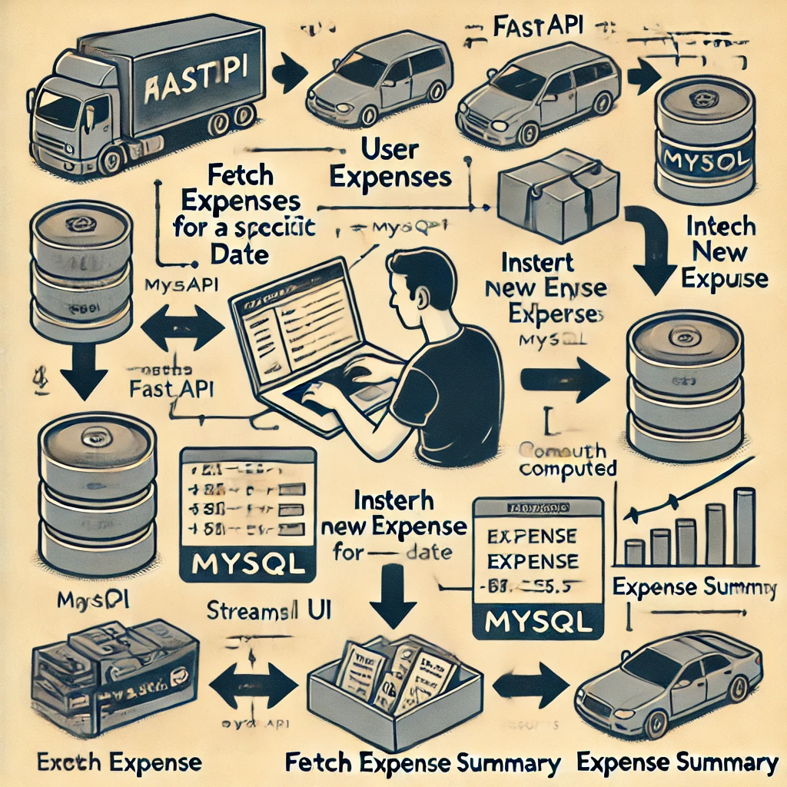

# 🏦 Expense Tracking System

## 🚀 Overview
The **Expense Tracking System** is a **full-stack application** built using:
- **Frontend:** Streamlit (User Interface)
- **Backend:** FastAPI (Handles API requests)
- **Database:** MySQL (Stores expense data)

It allows users to **add, update, and analyze expenses** using a **web-based UI**, with a **backend API** for data processing.

---

## **📊 System Architecture**
The architecture consists of:
1️⃣ **Streamlit Frontend:** Users enter expenses & view analytics  
2️⃣ **FastAPI Backend:** Handles requests & connects to the database  
3️⃣ **MySQL Database:** Stores expense details  

### **🛠️ Graphical Representation**
📌 **Expense Tracking System Flowchart**


---

## **🖥️ Installation & Setup**
### **1️⃣ Clone the Repository**
```bash
git clone https://github.com/reachmurali2/expense-tracker.git
cd expense-tracker
```

### **2️⃣ Install Dependencies**
```bash
pip install -r requirements.txt
```

### **3️⃣ Start the FastAPI Backend**
```bash
cd backend
uvicorn server:app --reload 
or 
uvicorn server:app --host 0.0.0.0 --port 8000 --reload
```
📌 **Backend Running at:** `http://127.0.0.1:8000`

📌 **Backend Running at:** `http://localhost:8000/docs`

### **4️⃣ Start the Streamlit Frontend**
```bash
cd frontend
streamlit run app.py
```
📌 **Frontend Running at:** `http://localhost:8501`

---

## **🔗 API Endpoints**
| **Endpoint** | **Method** | **Description** |
|-------------|-----------|----------------|
| `/expenses/{date}` | `GET` | Fetch expenses for a given date |
| `/expenses/{date}` | `POST` | Add/Update expenses |
| `/analytics/` | `POST` | Get expense breakdown by category |

### **📌 Example API Request**
```bash
curl -X POST "http://localhost:8000/expenses/2024-08-01" -H "Content-Type: application/json" -d '[
  {"amount": 100, "category": "Food", "notes": "Lunch"},
  {"amount": 200, "category": "Shopping", "notes": "Clothes"}
]'
```

---

## **🚀 Deployment Guide**
### ✅ **Deploy FastAPI Backend on AWS**
1️⃣ **Launch EC2 Instance**  
2️⃣ **Install Python & Dependencies**  
```bash
sudo apt update
sudo apt install python3-pip -y
pip install -r requirements.txt
```
3️⃣ **Run FastAPI with Uvicorn**
```bash
uvicorn server:app --host 0.0.0.0 --port 8000
```
✅ **API Hosted on AWS at:** `http://your-ec2-ip:8000`

---

### ✅ **Deploy Streamlit UI on Streamlit Cloud**
1️⃣ Push your project to GitHub  
2️⃣ Go to **[Streamlit Cloud](https://share.streamlit.io/)** → Deploy  
3️⃣ Set environment variable for API:
```
API_URL="http://your-ec2-ip:8000"
```
✅ **Frontend Live at:** `https://your-app.streamlit.app`

---

## **🛠️ Tech Stack**
- **Frontend:** Streamlit
- **Backend:** FastAPI
- **Database:** MySQL
- **Hosting:** AWS (Backend), Streamlit Cloud (Frontend)
- **Authentication:** (To be added)

---

## **🤖 Future Enhancements**
- ✅ **User Authentication (JWT, OAuth)**
- ✅ **Expense Categories Based on AI**
- ✅ **Mobile-friendly UI**
- ✅ **Dark Mode Support**

---

## **📩 Need Help?**
If you have any questions, feel free to open an **issue** in the GitHub repository or contact me at **reachmurali2@gmail.com**.

---
📌 **Developed with ❤️ using Streamlit & FastAPI**
